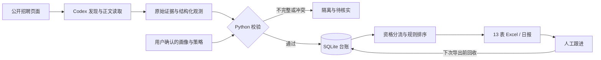

# Env AI Job Scout

**面向环境与 AI 交叉岗位的证据驱动求职追踪工具。** 将岗位发现、来源核验、资格判断和增量更新串成可审计流程，输出带历史与人工跟进的 Excel 台账。

[](https://github.com/s1encisi/env-ai-job-scout/actions/workflows/ci.yml)


[快速体验](#快速体验) · [架构与取舍](docs/ARCHITECTURE.md) · [使用说明](docs/USAGE.md) · [验证记录](TEST_REPORT.md) · [简历与面试](docs/PORTFOLIO.md)

## 项目解决什么问题

招聘信息更新快，搜索摘要未必代表岗位仍开放；技能匹配也不等于满足专业、学历和毕业届别要求。本项目将这些判断拆开：AI 负责发现与提取，Python 负责检查证据引用、来源授权范围、时效和资格规则，SQLite 保存权威记录，Excel 供人查看与跟进。

**定位：可运行的 AI 工作流工程原型。** 离线演示不需要模型、账号或第三方 Python 包；真实检索需要另外配置具备搜索和正文读取能力的 Codex 环境。

## 工程亮点

| 能力 | 实现方式 | 可检查的结果 |
| --- | --- | --- |
| 证据可追溯 | 原文落盘、SHA-256、逐字段引文及来源前缀校验 | 伪造引文、内容篡改、过期证据被拒绝或降级 |
| 资格与排序分离 | 硬条件按通过／不通过／未知判断，另做规则评分 | 未知专业或届别不默认通过，高分不能覆盖硬限制 |
| 增量持久化 | SQLite 台账、稳定岗位键、观测记录及变更事件 | 重复写入不增加岗位；复核与业务变更分开记录 |
| 人工参与 | 标准库生成 13 表 OOXML 工作簿，导出前回收人工跟进 | 投递状态、优先级和备注可跨导出保留 |
| 有界执行 | 单实例锁、配置漂移检测、子进程超时、断点索引 | 失败与未完成检索显式标为 failed / partial / blocked |
| 可复现验证 | 离线反例测试、虚构演示、Windows / Linux CI | 不依赖招聘网站在线或模型输出稳定性 |

## 快速体验

需要 Python 3.10+ 和 Git。以下命令可在 PowerShell 或常见终端中运行：

```sh
git clone https://github.com/s1encisi/env-ai-job-scout.git
cd env-ai-job-scout
python -m unittest discover -s tests -v
python examples/demo.py --output demo-output
```

演示使用保留域名 `example.test` 和显式虚构的用户、企业及证据，不发网络请求。它实际经过证据注册、岗位入库、重复写入、伪造引文隔离和 Excel 导出；输出目录已存在时拒绝覆盖。

| 演示结果 | 预期值 |
| --- | ---: |
| 去重岗位 | 1 |
| 重复写入增加岗位 | 0 |
| 被隔离的伪造观测 | 1 |
| 未核实入口 | 1 |
| Excel 工作表 | 13 |
| 真实检索任务完成数 | 0 / 24 |
| 运行状态 | `partial` |

打开 `demo-output/exports/环境_AI_岗位追踪_latest.xlsx` 查看工作簿；机器可读摘要在 `demo-output/demo-summary.json`。演示的“可投”仅表示虚构输入通过规则，不是真实可申请岗位。样本说明见 [examples/README.md](examples/README.md)。

## 数据流



核心设计与取舍见 [架构说明](docs/ARCHITECTURE.md)，逐项决定见 [ADR](docs/adr/)。

## 用于真实检索

先在仓库外初始化私人工作区：

```powershell
$Work = Join-Path $HOME 'env-ai-job-workspace'
python scripts/scout.py --workspace "$Work" init
```

编辑工作区中的 `profile.json`，只填写本人确认的信息；公共模板的全部个人事实均为 `unknown`。模板中的技能和研究方向是示例搜索关键词。随后依照 [使用说明](docs/USAGE.md)安装技能、检查实际工具能力并执行首次受控检索。每日 runner 默认只预览；定时任务需显式注册。

真实运行产物包括 `state/jobs.sqlite3`、`evidence/`、`reports/`、`exports/` 和 `memory/`。这些文件及私人画像不应提交至公共仓库。数据库是事实台账，Excel 和断点摘要是可重建的派生输出。

## 仓库导航

```text
scripts/          台账、校验、Excel、每日 runner 与调度脚本
examples/         无网络、无模型依赖的虚构演示
tests/           离线回归测试与共享虚构证据工厂
templates/       通用画像、策略、公司搜索种子与观测契约
references/      证据、来源、持久记忆、安全与 CLI 数据契约
docs/            架构、使用指南、简历材料、规格和 ADR
SKILL.md         Codex 执行协议
.github/workflows/ci.yml   跨平台离线检查
```

## 验证与边界

本地验证结果、环境和未验证项见 [TEST_REPORT.md](TEST_REPORT.md)；远端执行结果以页首 CI 链接为准。测试覆盖证据篡改、日期冲突、重复入库、资格未知、公式注入、人工备注回收和进程超时等场景。

项目没有宣称完成全网招聘召回评估、长期无人值守运行或求职成功率提升。SHA-256 验证文件完整性，真实来源与自然语言条件仍需可靠采集和复核。112 个企业种子是发现词，不是已核实招聘企业；30 小时时效与规则分数是可配置工程选择。

## 参与开发

修改后运行测试与离线演示，提交新文件后用 `python scripts/manifest.py build` 更新源码校验清单。详细约定见 [CONTRIBUTING.md](CONTRIBUTING.md)。公开可见不等于自动授予再分发许可；当前仓库未声明开源许可证。
