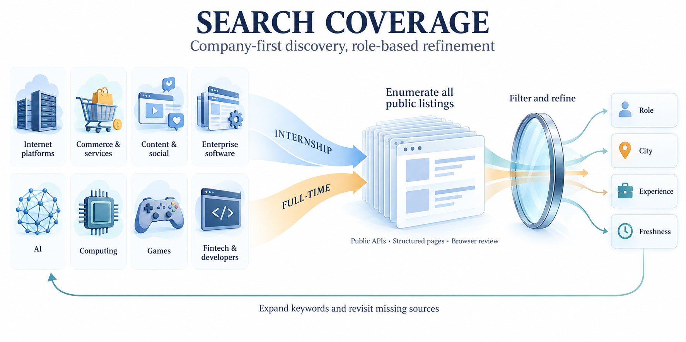

# 岗位发现与覆盖机制



## 企业优先，岗位筛选后置

1. 从企业／品牌目录取未访问入口，再按上次访问时间轮转。
2. 招聘主站分别检查实习、校园和社会招聘。主站链接到ATS时记录官方跳转页和具体租户。
3. 公开接口或招聘列表先不带职位关键词列举，跟随真实分页；职位关键词用于补漏。
4. 保存列表、职责、要求和来源时间；在本地按12个职类、城市、实习／全职筛选。
5. 个人画像只用于后续资格核验，不作为发现阶段的准入条件。

## 三条采集路径

**公开API**：腾讯、网易、米哈游的专用适配器校验响应字段、页码、总量和职位身份。腾讯与米哈游列表缺少完整要求时使用独立详情预算。网易的用工编码映射来自其官网脚本。

**结构化网页**：解析 JobPosting JSON-LD，保存规范字段和真实 next 链接。没有职位结构的动态页面保存招聘相关链接并进入浏览器队列，不记成“零岗位已完成”。

**搜索与浏览器**：按 `plan` 的 `queries` 逐一检索，每次只组合企业、通道和一组角色词。先查官方站点，再用高校就业网、企业官方账号等补充原始入口。浏览器导出的真实正文通过 `import` 接回同一目录。

字节飞书适配器已实现响应解析，但当前实测为HTTP 405，进入浏览器路径。Moka、北森等站点按实际公司租户与页面操作；通用解析不等于已接通其私有接口。

## 查询展开

- 企业名 + 实习 / 日常实习 / 暑期实习
- 企业名 + 校园招聘 / 社会招聘 / 全职
- `site:官方招聘域名` + 招聘通道
- 企业名 + 职类同义词：如后端／后台／服务端，或游戏引擎／渲染／技术美术
- 城市只在专项补漏时加到查询中；首次全量列举不限定北上广深

每天优先未访问企业，避免只反复搜索熟悉的大厂。每周查看企业、职类、城市和实习／全职分布，再扩充目标目录。

## 分页、更新与恢复

`collect` 每页提交岗位和下页游标，`--resume` 从未完成位置继续；不加 `--resume` 则从首页重新扫描以发现更新。页内容重复、响应格式变更、HTTP错误或预算耗尽会保留进度。

`complete` 表示该列表本轮到达源站末页；岗位唯一数量可能小于源站返回条数。源站在翻页期间也可能更新，因此仍需周期性从首页重扫。未出现的旧岗标记为过期观察，不凭一次列表缺失自动关闭。

## 新来源接入

将官网包含企业名与招聘链接的实际导出放到工作区 `evidence/`，调用：

```powershell
python scripts/discovery.py --workspace tech-workspace source-add --company example-tech --name 示例科技 --sector 企业软件与云 --url https://jobs.example.test/ --official-page https://www.example.test/careers --capture evidence/official-export.txt
```

上面的保留域名仅说明参数。实际使用填写真实URL和采集文件。新来源写入工作区 `sources/registry.json`，合并进下次计划，无须修改分发源码。每日runner持锁时把登记JSON放入inbox/sources/，外层退出会话锁后自动登记，再导入同批浏览器岗位。

## 执行预算

默认每源3页、每页50条、全局200次请求、20个详情、12个来源，同一主机请求至少间隔1秒；失败最多重试2次，尊重Retry-After与robots规则。命令行可增加页数、请求和详情预算，报告保留实际用量。

访问受限页面转浏览器处理；搜索摘要用于定位入口。报告分别统计目录目标、已尝试来源、完成列表、正文可用岗位与个人资格已核验岗位。
